# QuietHire System Architecture

## Table of Contents
- [Overview](#overview)
- [Architecture Principles](#architecture-principles)
- [System Context](#system-context)
- [Container Architecture](#container-architecture)
- [Component Breakdown](#component-breakdown)
- [Data Flow](#data-flow)
- [Technology Stack](#technology-stack)
- [Deployment Architecture](#deployment-architecture)
- [Scalability & Performance](#scalability--performance)

---

## Overview

QuietHire is a real-time job search engine built as a Docker-first monorepo application. The system is designed to:
- Index authentic job openings (public and hidden)
- Automatically filter ghost/fake postings
- Extract hiring manager contact information
- Enable direct outreach to decision-makers

**Core Value Proposition:** Type any role → instantly see only real jobs + the exact person to message.

---

## Architecture Principles

### 1. **Docker-First Design**
- Every service runs in a container from day one
- Single `docker-compose.yml` orchestrates the entire stack
- Easy transition to Kubernetes/Docker Swarm when needed

### 2. **Monorepo Structure**
- All code lives in one repository
- Shared tooling and dependencies
- Simplified deployment and versioning

### 3. **Microservices Architecture**
- Services communicate via APIs and message queues
- Each service has a single responsibility
- Independent scaling of components

### 4. **Polyglot Approach**
- Go for high-performance APIs and crawlers
- Python for ML/AI workloads and complex parsing
- Choose the right tool for each job

### 5. **Observability-First**
- Comprehensive logging, metrics, and tracing from the start
- Grafana stack for unified monitoring
- Proactive error detection with Sentry

---

## System Context

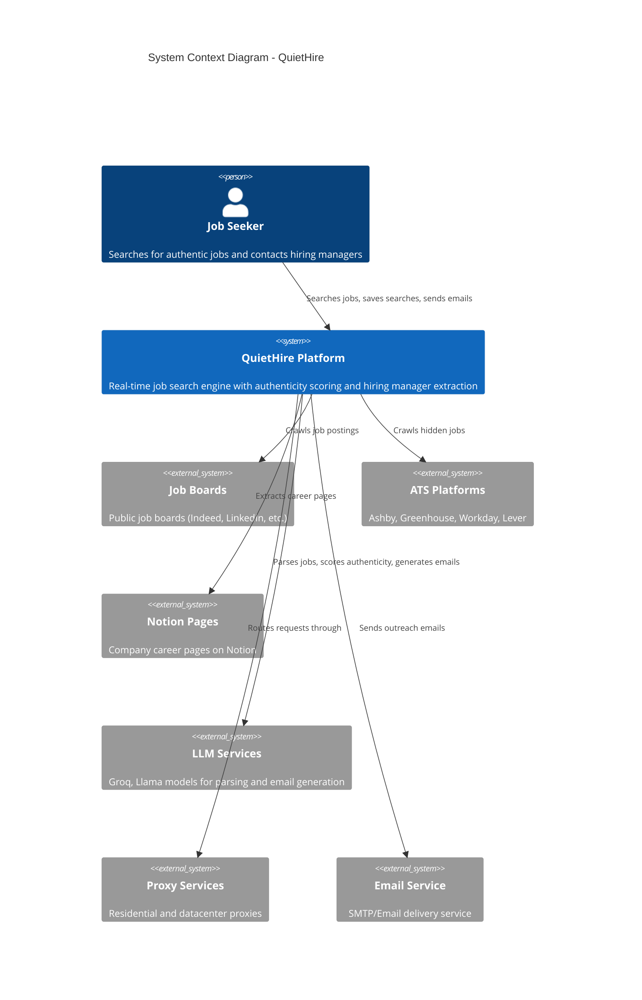

---

## Container Architecture

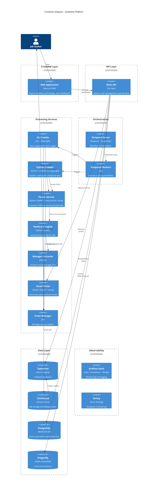

---

## Component Breakdown

### Frontend Components

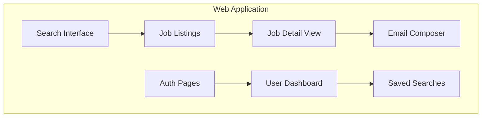

### API Service Components

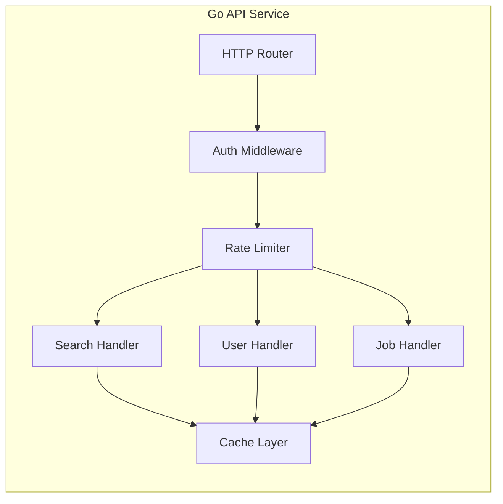

### Crawler Components

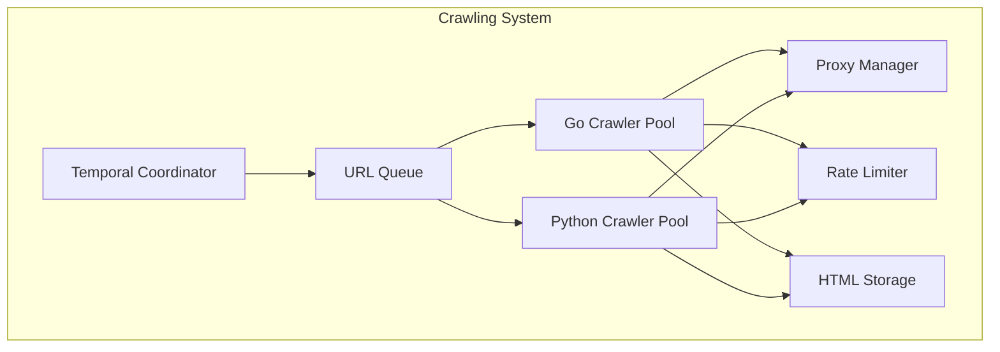

### Processing Pipeline Components

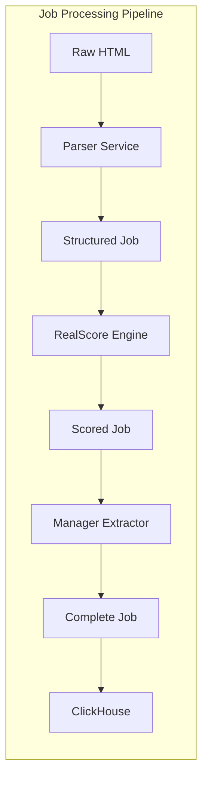

---

## Data Flow

### End-to-End User Search Flow

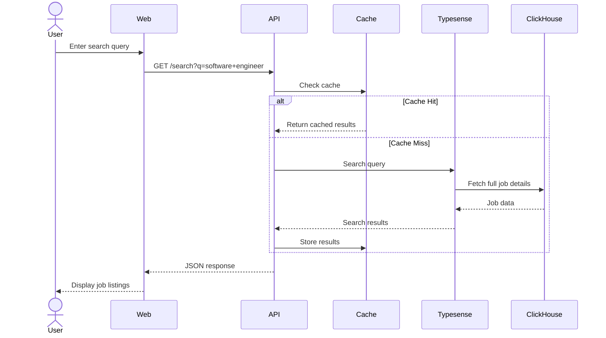

### Crawling and Ingestion Flow

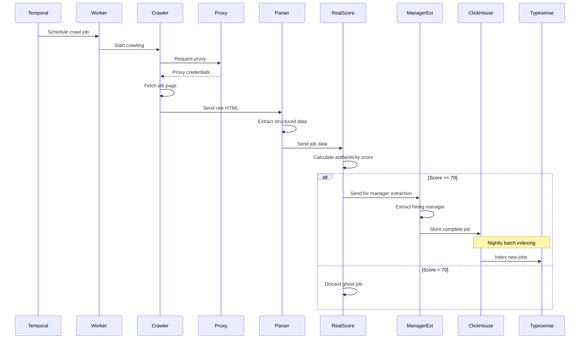

### Email Generation Flow

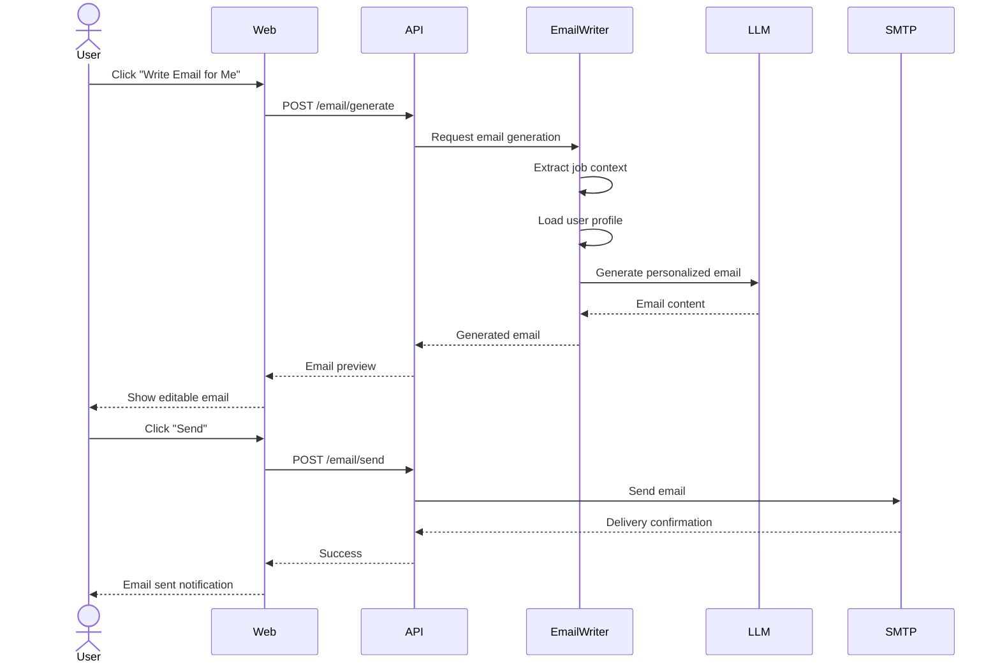

### Data Deduplication Flow

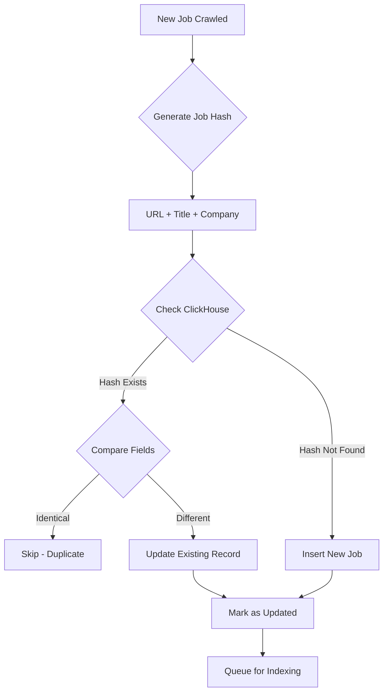

---

### Languages & Frameworks

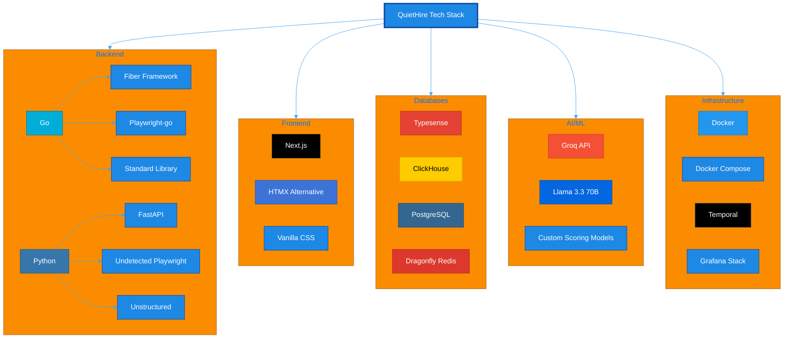

### Service Technology Mapping

| Service | Language | Framework/Library | Purpose |
|---------|----------|-------------------|---------|
| **Main API** | Go | Fiber | High-performance REST API |
| **Go Crawler** | Go | Playwright-go | Fast static page crawling |
| **Python Crawler** | Python | Undetected Playwright | Stealth crawling |
| **Parser** | Python | FastAPI + Unstructured + Groq | HTML to structured data |
| **RealScore** | Python | FastAPI + Custom ML | Authenticity scoring |
| **Manager Extractor** | Python | Custom + NLP | Contact extraction |
| **Email Writer** | Python | FastAPI + Llama 3.3 | Email generation |
| **Proxy Manager** | Go | Standard Library | Proxy rotation |
| **Temporal Workers** | Go | Temporal SDK | Workflow execution |
| **Web Frontend** | JavaScript | Next.js/HTMX | User interface |

---

## Deployment Architecture

### Local Development

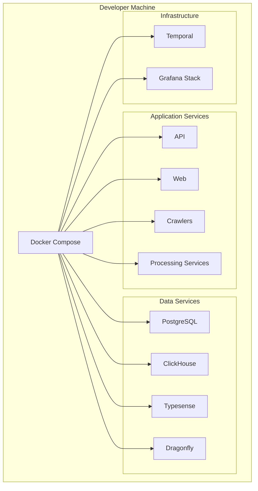

### Scaling Strategy

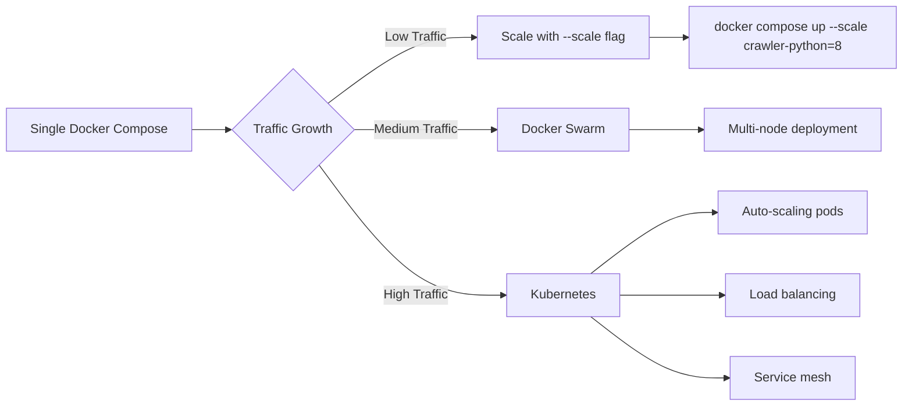

### Service Scaling Configuration

```yaml
# Example scaling scenarios
# Low traffic (1-1000 users)
- api: 2 instances
- crawler-go: 4 instances
- crawler-python: 4 instances
- typesense: 1 node

# Medium traffic (1000-10000 users)
- api: 4-6 instances
- crawler-go: 6-8 instances
- crawler-python: 8-12 instances
- typesense: 3 nodes (cluster)

# High traffic (10000+ users)
- api: 10+ instances (auto-scale)
- crawler-go: 10+ instances
- crawler-python: 12+ instances
- typesense: 3-5 nodes
- clickhouse: cluster mode
```

---

## Scalability & Performance

### Performance Targets

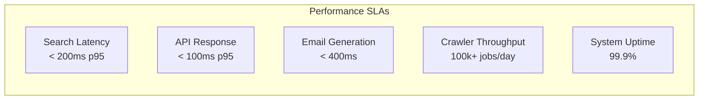

### Caching Strategy

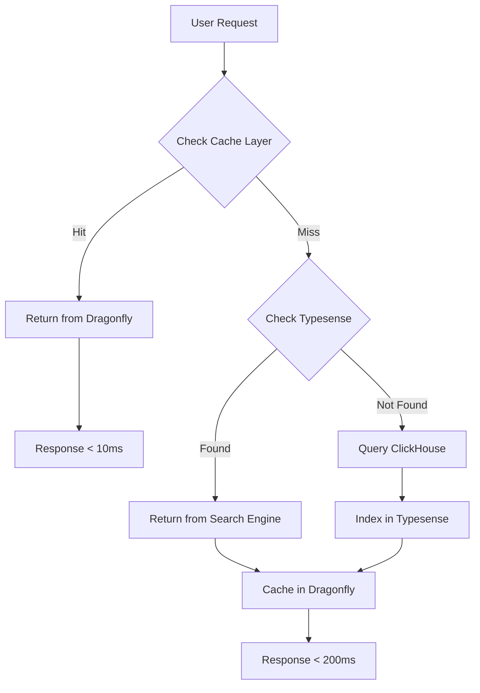

### Database Optimization

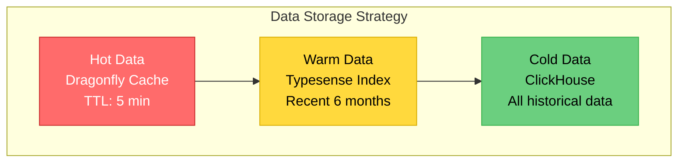

### Horizontal Scaling Points

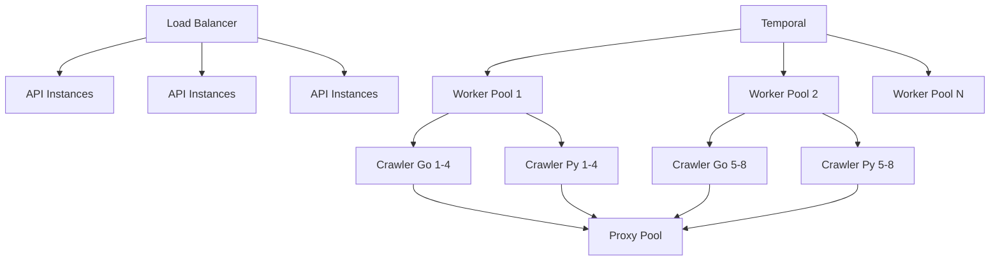

---

## Security Architecture

### Authentication Flow

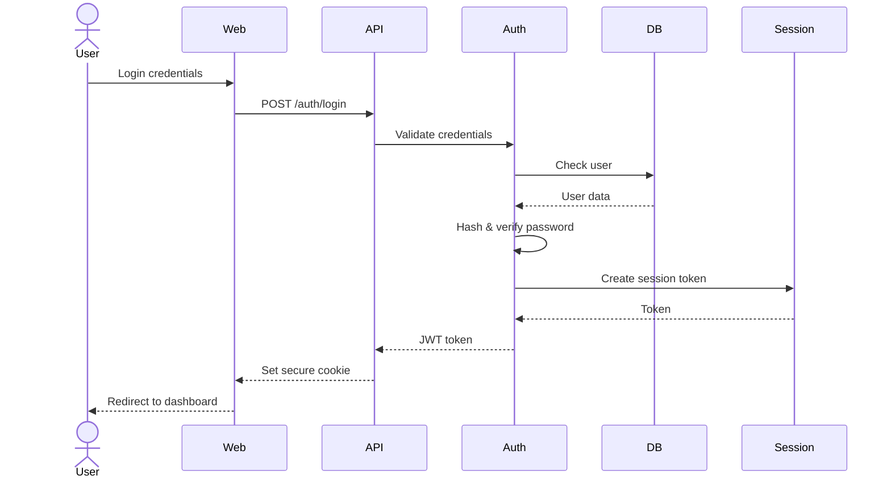

### Data Protection Layers

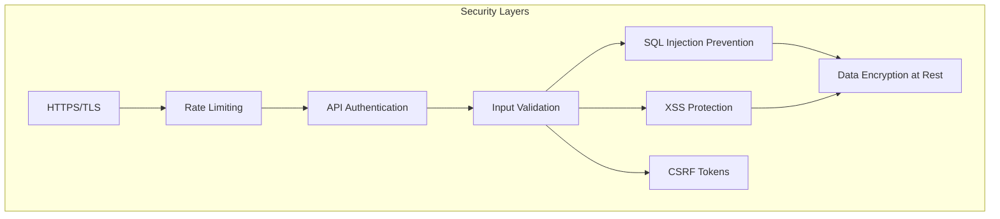

---

## Monitoring & Observability

### Observability Stack

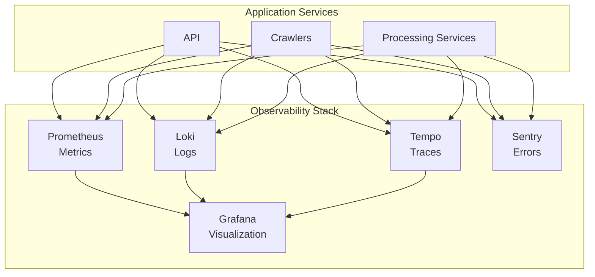

### Key Metrics Dashboard

```mermaid
graph LR
    subgraph "Monitored Metrics"
        A[Request Rate<br/>req/sec]
        B[Error Rate<br/>%]
        C[Latency<br/>p50, p95, p99]
        D[Crawler Success<br/>%]
        E[Database Connections<br/>active/max]
        F[Cache Hit Rate<br/>%]
        G[Queue Depth<br/>pending jobs]
        H[System Resources<br/>CPU, Memory, Disk]
    end
```

---

## Disaster Recovery

### Backup Strategy

```mermaid
flowchart TD
    A[Data Sources] --> B{Backup Type}
    
    B -->|Critical| C[PostgreSQL]
    C --> D[Daily Full Backup]
    C --> E[Hourly Incremental]
    
    B -->|Important| F[ClickHouse]
    F --> G[Daily Backup]
    
    B -->|Rebuildable| H[Typesense]
    H --> I[Weekly Snapshot]
    
    D --> J[S3/Cloud Storage]
    E --> J
    G --> J
    I --> J
    
    J --> K[30-day Retention]
```

### Failure Recovery

```mermaid
sequenceDiagram
    participant Monitor
    participant Alert
    participant OnCall
    participant System
    participant Backup

    Monitor->>Monitor: Detect failure
    Monitor->>Alert: Trigger alert
    Alert->>OnCall: Notify (PagerDuty/Email)
    
    alt Automatic Recovery
        Monitor->>System: Restart service
        System-->>Monitor: Health check OK
    else Manual Recovery Required
        OnCall->>System: Investigate
        OnCall->>Backup: Restore if needed
        Backup-->>System: Data restored
        OnCall->>System: Restart services
    end
    
    System->>Monitor: Resume monitoring
```

---

## Future Architecture Considerations

### Phase 1: Current State (Weeks 1-30)
- Single Docker Compose deployment
- Manual scaling with `--scale` flag
- Single-region deployment

### Phase 2: Growth (Months 10-12)
- Migrate to Docker Swarm or Kubernetes
- Multi-region deployment
- Auto-scaling based on metrics
- CDN for static assets

### Phase 3: Scale (Year 2+)
- Global deployment across multiple regions
- Advanced caching with edge computing
- Machine learning model improvements
- Real-time collaboration features

```mermaid
timeline
    title Architecture Evolution
    Phase 1 (Months 1-7) : Docker Compose
                          : Single Server
                          : Manual Scaling
    Phase 2 (Months 8-12) : Docker Swarm/K8s
                           : Multi-node Cluster
                           : Auto-scaling
    Phase 3 (Year 2+) : Multi-region
                      : Edge Computing
                      : Advanced ML
```

---

## Conclusion

This architecture is designed for:
- **Simplicity**: Start with Docker Compose, scale when needed
- **Flexibility**: Polyglot approach using the best tool for each job
- **Observability**: Comprehensive monitoring from day one
- **Scalability**: Clear path from single server to global deployment
- **Maintainability**: Solo developer can understand and manage the entire system

The modular design allows incremental development while maintaining system integrity. Each service can be developed, tested, and deployed independently, making it ideal for solo development with the ability to scale as the platform grows.
